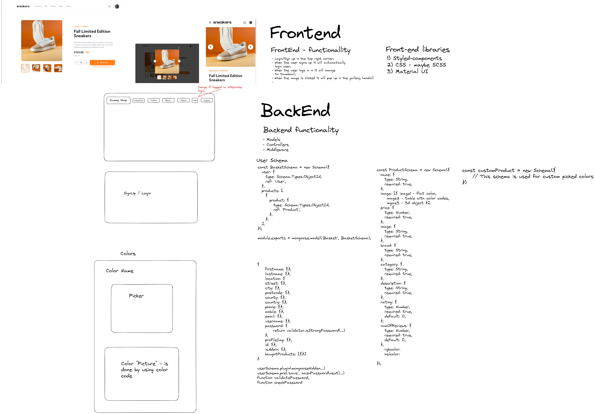
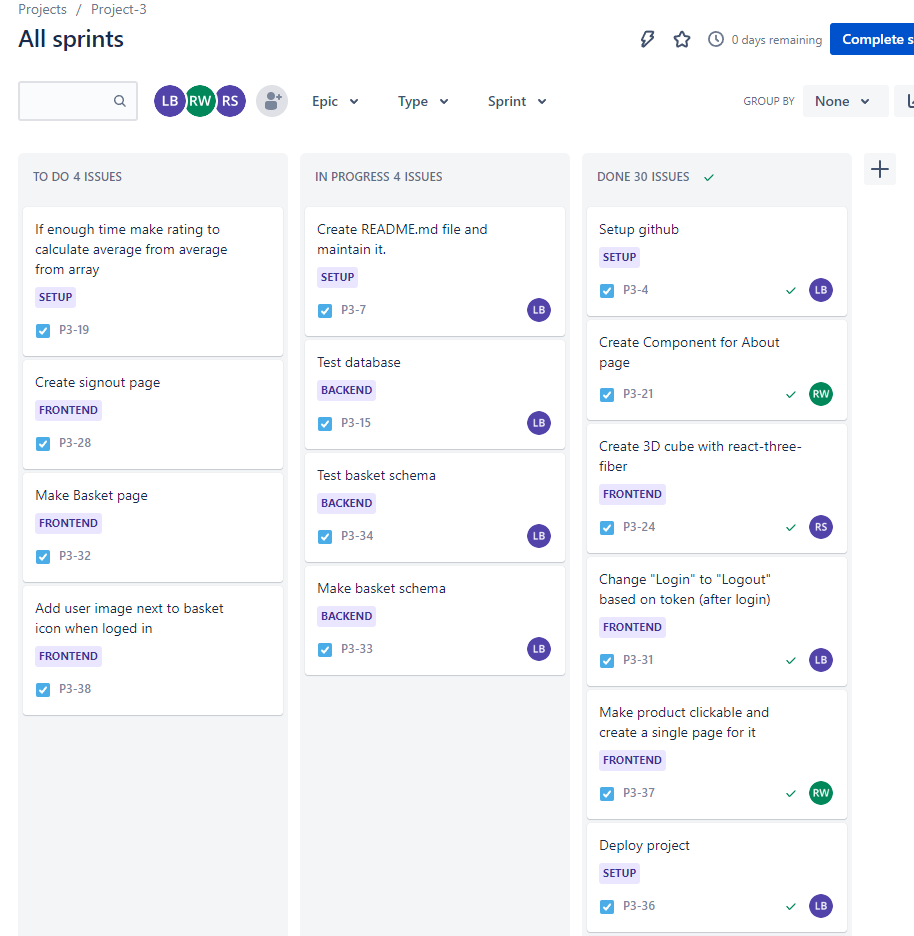
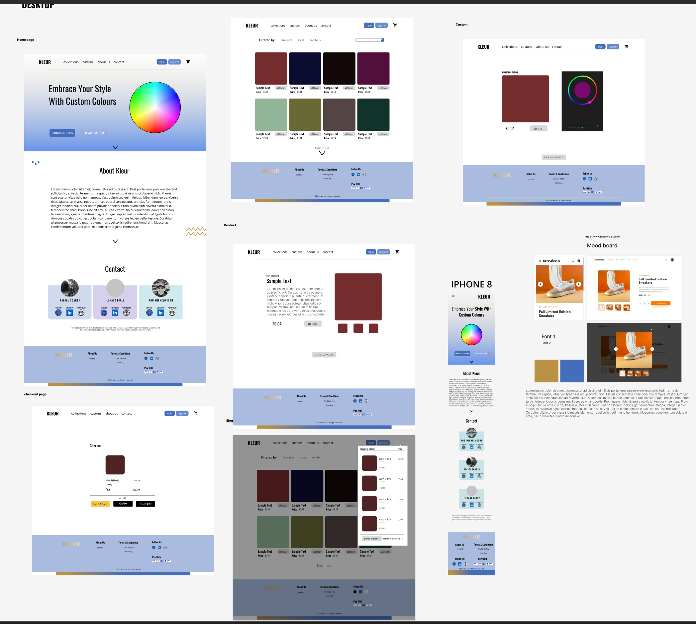

# GA SEI PROJECT 3 - E-Commerce Website

This project was created as a part of the General Assembly Software Engineering Immersive course. This was a group project made alongside with:

- Rafael Velho Soares [<https://github.com/Rafaelvsoares>]
- Rob Wilhelmsson [<https://github.com/robwilhelmsson>]

Our task was to create a full-stack application using the MERN stack.

The application had to be a CRUD application with multiple models. It had to be deployed online and to have automated tests for at least one RESTful resource on the back-end. I was responsible for the backend and login with signup on the front-end part of the application. Also, I was responsible for deployment and GitHub repositories. We used Jira to plan and manage our project.

## Getting started and deployment

- This project is split into two repositories. One for the backend:  
  <https://github.com/Mehcanic/project-3-backend>  
  and one for the front-end: 
  <https://github.com/Mehcanic/project-3-frontend>

- The front-end is available to view [here](<https://project-kleur.netlify.app/>)
- If you would like to take a look at the code please clone it and run:

```console
npm install
```

- Make sure you have MongoDB installed on your computer.
- If you have it please run:

```console
mongod --dbpath ~/data/db
```

- Than run:

```console
npm run dev
```

## Timeframe

- The time frame for the project was 2 weeks.

## Technologies used for the backend

- Node.js
- Express
- MongoDB
- Mongoose
- Bcrypt
- JsonWebToken
- Validator
- Cors
- Netlify
- lfy.io
- Jira

## Brief

- Work in a team, using git to code collaboratively.
- Build a full-stack application by making our own backend and front-end
- Use an Express API to serve our data from a Mongo database
- Consume our API with a separate front-end built with React
- Be a complete product which most likely means multiple relationships and CRUD functionality for at least a couple of models
- Implement thoughtful user stories/wireframes that are significant enough to help us know which features are core for MVP and which we can cut
- Have a visually impressive design to kick our portfolio up a notch and have something to wow future clients & employers. ALLOW time for this.
- Be deployed online so it's publicly accessible.
- Have automated tests for at least one RESTful resource on the back-end. - Improve our employability by demonstrating a good understanding of testing principles.

## Planning and Development procces

1. Our first step was to decide on features for the application. We used Excalidraw for the initial wireframe of the project:


2. The next step was to create GitHub repositories for the project and to create a Jira board to plan and manage the project and tasks for it:


3. Rafael took his time to create a wireframe in Figma. He was also responsible for the custom 3d cube done with three.js:


    Rob was responsible for the front-end part of the project. He used Material UI to create the design of the application. He also created the login and signup forms. He also created the router for the application.

    Rob was responsible for the front-end part of the project. He used Material UI to create the design of the application. He also created the login and signup forms. He also created the router for the application.

    We all worked together to create models for the users. Below is the code to define the model for the user in the back-end of the application. This is a pretty standard structure for a simple user model. Also, I used the validator to make sure that the user will add an email when registering on the website:

      ```javascript
    const userSchema = new mongoose.Schema({
      username: { type: String, unique: true, required: true },
      email: { type: String, unique: true, required: true,
        validate: (email: string) => validator.isEmail(email)
      },
      password: { type: String, required: true,
        validate: (password: string) => {
          return validator.isStrongPassword(password, 
          { minLength: 8, minLowercase: 1, minUppercase: 1, minNumbers: 1, minSymbols: 1 })
        }
      },
      phone: { type: String },
      profileImg: { type: String },
      isAdmin: { type: Boolean },
      basket: [],
      boughtProducts: []
    })
      ```

    and for the products:

    ```javascript
    const productSchema = new mongoose.Schema({
      name: { type: String, required: true, unique: true, },
      brand: { type: String },
      colorCode: { type: String, required: true },
      price: { type: Number, required: true },
      discount: { type: Number },
      decription: { type: String },
      rating: { type: Number, min: 0, max: 5, default: 5, },
      images: [
        { type: String }
      ]
    });
    ```

    We decided that we will keep the basket inside the user model. It was easier to manage the basket this way. We also decided to keep the bought products inside the user model.

4. After models were created, I set up the app in index.ts file and made sure it was connecting with the database. The below code is for the already deployed app. As for project setup; I didn’t setup any environment until MVP was done:

    ```javascript
    import express from "express";
    import cors from 'cors'
    import mongoose from "mongoose";
    import router from "./views/router";
    import { MONGODB_URI, PORT } from './config/environment'

    const app = express()
    app.use(express.json())
    app.use(cors())

    app.use('/api', router)

    async function start() {
      await mongoose.connect(MONGODB_URI)
      console.log("Connected to the database!")

      const serverPromise = app.listen(PORT, () => {
        console.log(`Express API is running on localhost:${PORT}`)
      })

      return serverPromise
    }
    start()

    export default app
    ```

5. The next step was to create the first simple user and product controllers to make sure the app is working:

    ```javascript
    export async function getUsers(req: Request, res: Response) {
      try {
        const users = await Users.find()
        res.send(users)
      } catch (error) {
        console.log(error)
        res.send({ message: "There was an error getting all users" })
      }
    }

    export async function getOneProduct(req: Request, res: Response) {
      try {
        const productId = req.params.productId
        const product = await Products.findById(productId)
        res.send(product)
      } catch (error) {
        console.log(error)
        res.send({ message: "There was an error getting the product." })
      }
    }
    ```

6. When controllers were responding in the Insomnia app I started creating routes for the application and the rest of the controllers:

    ```javascript
    router.route('/users').get(secureRoute, getUsers)

    router.route('/users/:userId/basket/:productId').post(secureRoute, addToBasket)

    router.route('/signup').post(signUp)
    ```

7. When everything was set up I started to work on seeding the database. In case of any code changes it speeds up working on the app when the database already has some information in it:

    ```javascript
    function getProductData(user: any) {
      return [
        {
          name: "Pepper Red",
          ...,
        },
      ]
    }
    const userData = [
      {
        username: "lukasz",
        ...
      },
    ]

    async function seed() {
      await mongoose.connect(MONGODB_URI)
      console.log("Connected to the databse!")

      await mongoose.connection.db.dropDatabase()
      console.log("Database cleared.")

      const user = await Users.create(userData)
      const productData = getProductData(user)
      const products = await Products.create(productData)

      await mongoose.disconnect()
    }
    seed()
    ```

8. After creating the seed file, I created the login and signup functionality for the application. For the login and signup functionality, I used bcrypt to hash the password, mongoose hidden to hide elements of the user object from access by unauthorised users and jwt to create the token. The token is stored in the local storage of the browser.

    ```javascript
    export const secret = 'super secret message'
    import bcrypt from 'bcrypt'
    userSchema.plugin(mongooseHidden({ defaultHidden: { password: true, email: true, phone: true, isAdmin: true, profileImg: true } }))

    userSchema.pre('save', function hashPassword(next) {
      this.password = bcrypt.hashSync(this.password, bcrypt.genSaltSync())
      next()
    })
    ```

9. I also created a secure route for the application. The secureRoute is used to make sure that the user cannot make any actions except signup or login. The login session is kept in the local storage in the browser. The Front-end part of the project is responsible for it:

    ```javascript
    export default function secureRoute(req: Request, res: Response, next: NextFunction) {
      const rawToken = req.headers.authorization
      if (!rawToken) {
        return res.status(401).json({ message: "Unauthorized" })
      }
      const token = rawToken.replace("Bearer ", "")
      jwt.verify(token, secret, async (err, payload) => {
        if (err || !payload) {
          return res.status(401).json({ message: "Unauthorized" })
        }
        const jwtPayload = payload as JwtPayload
        const user = await Users.findById(jwtPayload.userId)
        req.currentUser = user
        console.log("Token works properly")
        next()
      })
    }
    ```

## Challenges

- This was my first back-end project using MongoDB, Mongoose and ExpressJS. There was a lot of new information to get comfortable with to understand how to create controllers for the application.
- Making the removeFromBasket() controller for the user was a big headache. I spent a lot of time on it and I was struggling to understand how it works. Later, I realised that it was because I was too focused on my initial approach to this function. When I gave myself some time off from it, all pieces went into the right places and the function started to work as I intended to make it:

    ```javascript
      export async function removeFromBasket(req: Request, res: Response) {
      try {
        const user = await Users.findById(req.params.userId)
        if(!user) {
          return res.send({ message: "Customer not found" })
        }
        const basketItem = await Products.findById(req.params.productId)
        console.log(basketItem)
        const removeProduct = await Users.findByIdAndUpdate({
          _id: user,
          basket: {
            $elemMatch: {
              _id: req.params.productId
            }
          }
        }, {
          $pull: {
            _id: req.params.productId
          }
        })
        res.send({ message: `Removed product: "${basketItem}.`})
      } catch (error) {
        console.log(error)
        res.send({ message: "There was an error when removing the product from the basket!" })
      }
    }
    ```

## Wins

Writing a simple but functioning CRUD application was a big win for me. I am happy that I managed to create, and more importantly, understand the way the application works. The user controllers for the basket aren't perfect but they are working. I am happy that I managed to create the removeFromBasket() controller. It was a big win for me.

## Key learnings

I think I have two major takeaways from this project. The first one is that working on the project in a group is way more efficient and fun. We can help each other out any time and not feel so overwhelmed by the task. When I was stuck on the seed file and Rob needed a break from the front-end, he came and helped me to write the signup and login controllers.

The second learning is that when I struggled with the code at any point, giving myself a break from this part of the project was really important. When I needed a break from something, I started to work on front-end or validation for the models. It gave my mind some breathing room and after a few hours, I could take a look at the problem from a different perspective.

## Future improvements

- ’m currently working on fixing the removeFromBasket() controller as it’s not functioning as intended. I’ve identified a few issues I’m addressing and will keep you updated on my progress.
- I’m planning to create a separate basket model as having it inside the user model is not an optimal solution. I’d like to have a basket inside a basket model instead. This will help us keep our code organised and make it easier to maintain in the long run.
